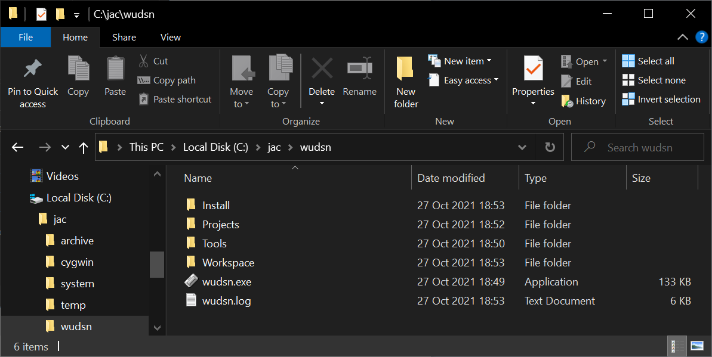
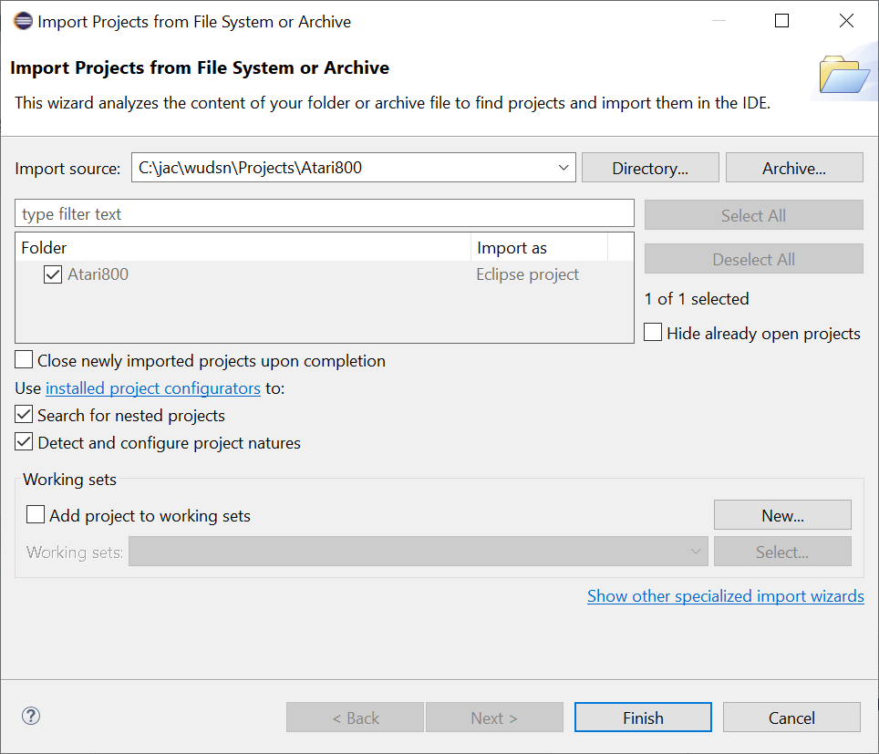
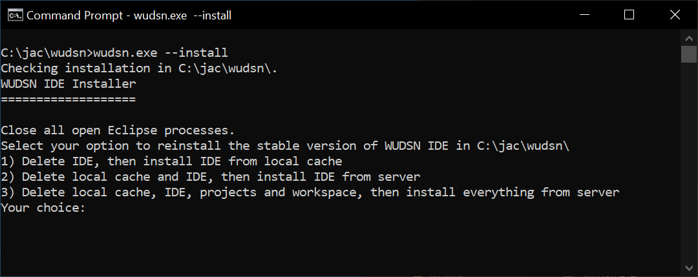

# WUDSN IDE Installer

Create a folder where you want to put the IDE.
Make sure the folder path contains no spaces or whitespaces.

On Windows, download wudsn.exe to the folder and run it.
- https://github.com/peterdell/wudsn-ide-install/wudsn.exe
 
Versions for macOS and Linux are in the making.

The file will create and populate the following subfolders via downloads:
- Install - the cache folder where all downloads are stored
- Tools - the IDE and all related command line programs
- Projects - the platform specific project folders with sample source code
- Workspace - the workspace where the IDE stores data that is no source code

Upon the first start you can import projects for the platform you'd like to work with into the workspace.
Click "File / Open Projecs from File System" and select the platform folder from the "Projects" folder.

The path to the assemblers/compilers/emulators in the Tools folder must be set once manually.
I plan to improve this in future releases of the IDE.

In case of problems check the "wudsn.log" file in the folder.
You can also run "wudsn.exe" from the command line with the parameter --install.
This will display the installer menu with options to reinstall or update the IDE.

