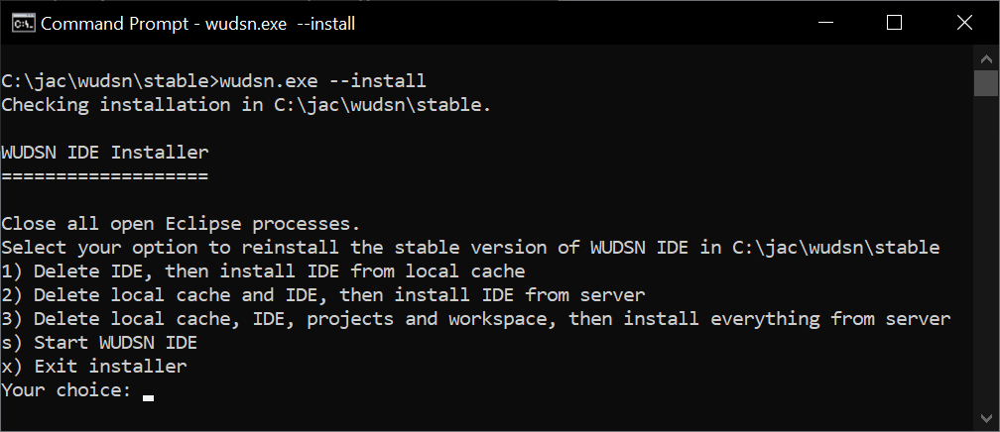

# WUDSN IDE Installer

The WUDSN IDE installer is the simplest way to install [WUDSN IDE](https://github.com/peterdell/wudsn-ide).

Create a folder where you want to put the IDE. 
Make sure the folder path contains no spaces or whitespaces. 
Download the relevant installer version for your operating system. 
To do this, you have to right-click the respective link and choose "Save link as..." from the context menu.

On **Windows** (64-bit Intel), download "wudsn.exe" to the folder and run it.
- https://github.com/peterdell/wudsn-ide-install/raw/main/wudsn.exe
  
On **macOS** (64-bit Intel or ARM/M1), download "wudsn.command.tar.gz" extract its contents to the folder run "wudsn.command".
- https://github.com/peterdell/wudsn-ide-install/raw/main/wudsn.command.tar.gz

Because macOS blocks unsigned downloads by default you have to open the "System Preferences / Security and Privacy" on the first start of the script and click "Open Anyway".

 
On **Linux**, click the link below to download "wudsn.tar.gz" to the folder, extract its contents and run "wudsn.sh".
- https://github.com/peterdell/wudsn-ide-install/raw/main/wudsn.tar.gz

The file will create and populate the following subfolders via downloads:
- Install - the cache folder where all downloads are stored
- Tools - the IDE and all related command line programs
- Projects - the platform specific project folders with sample source code
- Workspace - the workspace where the IDE stores data that is no source code

Upon the first start you can import projects for the platform you'd like to work with into the workspace.
Click "File / Open Projects from File System" and select the platform folder from the "Projects" folder. 

The path to the emulators in the Tools folder must be set once manually.
I plan to improve this in future releases of the IDE.
  
In case of problems check the "wudsn.log" file in the folder.
You can also run "wudsn.exe" from the command line with the parameter --install.
This will display the installer menu with options to reinstall or update the IDE.

